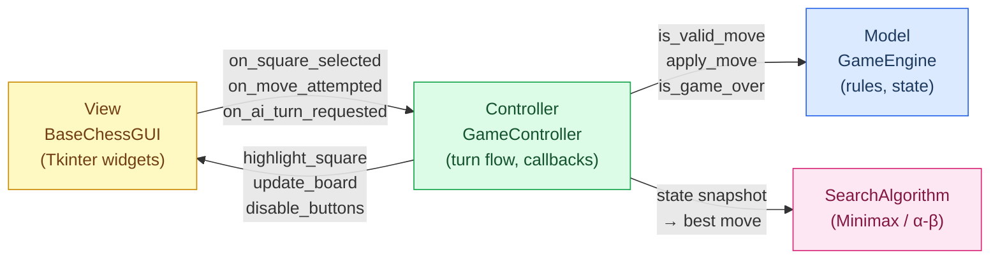
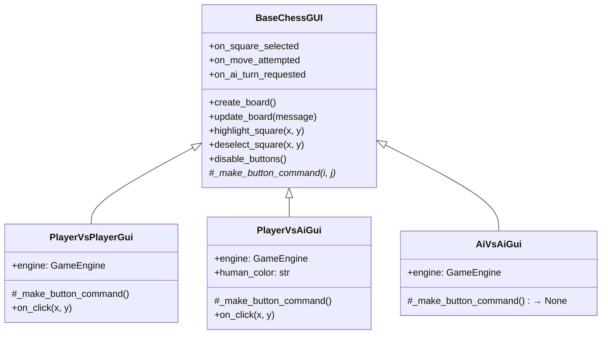
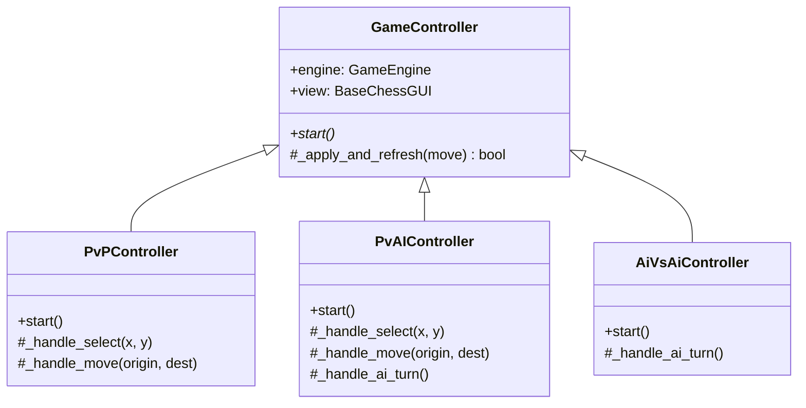
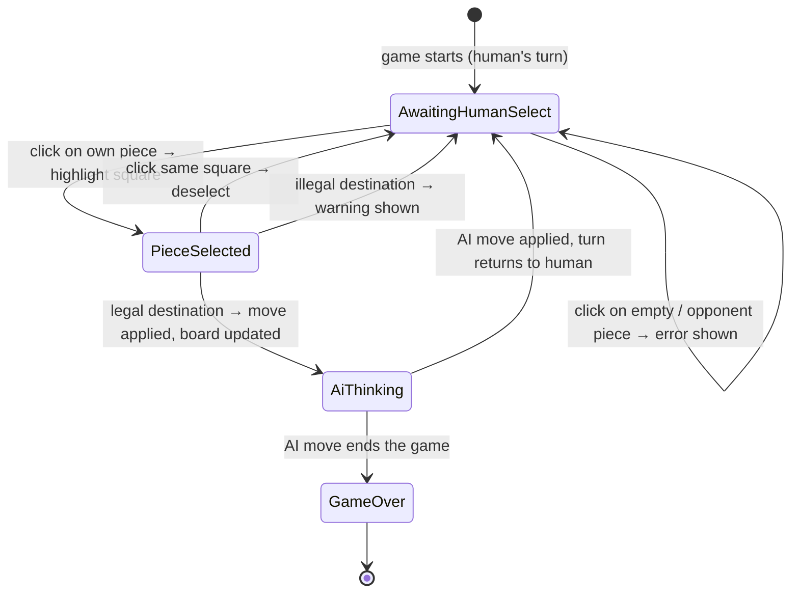

# MiniChess

> A 5×5 chess variant with a Tkinter GUI, supporting Human vs Human, Human vs AI, and AI vs AI modes.  
> The AI uses Minimax search with optional Alpha-Beta pruning and three pluggable heuristics.

---

## Table of Contents

1. [Quick Start](#quick-start)
2. [Game Modes](#game-modes)
3. [AI Configuration](#ai-configuration)
4. [Heuristics](#heuristics)
5. [Architecture](#architecture)
6. [Project Structure](#project-structure)
7. [Turn Flow](#turn-flow)
8. [Extending the Project](#extending-the-project)
9. [Running Tests](#running-tests)

---

## Quick Start

**Requirements:** Python 3.10+, Tkinter (included in the standard library on macOS/Windows; `sudo apt-get install python3-tk` on Linux)

```bash
# Clone and run — no extra dependencies required
git clone <repo-url>
cd MiniChessGUI-main
python main.py
```

---

## Screenshots


---

## Game Modes

| Mode                 | Description                                  |
| -------------------- | -------------------------------------------- |
| **Player vs Player** | Two humans share one keyboard/mouse.         |
| **Player vs AI**     | Human plays White; AI plays Black.           |
| **AI vs Player**     | AI plays White; human plays Black.           |
| **AI vs AI**         | Fully autonomous — watch the AI play itself. |

---

## AI Configuration

These options appear in the menu whenever an AI mode is selected:

| Setting                | Type           | Description                                                                                    |
| ---------------------- | -------------- | ---------------------------------------------------------------------------------------------- |
| **Max Turns**          | `int`          | Game is declared a draw if neither king is captured within this many half-moves.               |
| **Max Time**           | `float` (sec)  | Time budget per AI move. The search returns the best move found so far when the clock expires. |
| **Heuristic**          | `e0 / e1 / e2` | Evaluation function the AI uses to score leaf nodes. See [Heuristics](#heuristics).            |
| **Alpha-Beta Pruning** | `bool`         | Enables α-β cutoffs. Strongly recommended — same move quality, significantly less search time. |

---

## Heuristics

All three heuristics return a score where **positive = White advantage, negative = Black advantage**.

| ID   | Strategy            | Key idea                                                                                    |
| ---- | ------------------- | ------------------------------------------------------------------------------------------- |
| `e0` | Pure material       | Sums piece values: K=999, Q=9, B=3, N=3, p=1.                                               |
| `e1` | Material + position | Adds a positional bonus for pieces near promotion rows, centre control, and active squares. |
| `e2` | Extended            | Builds on `e1` with additional strategic factors.                                           |

---

## Architecture

The project follows **Model-View-Controller (MVC)**. Full details are in [ARCHITECTURE.md](src/documents/ARCHITECTURE.md).



**One rule per layer:**

- **Model** — knows everything about the game, knows nothing about screens.
- **View** — draws what it is told, never decides what is legal.
- **Controller** — translates clicks into engine calls, engine results into draw calls.
- **SearchAlgorithm** — receives a state snapshot, returns a move; has no GUI dependency.

### GUI Class Hierarchy



### Controller Class Hierarchy



---

## Project Structure

```
MiniChessGUI-main/
│
├── main.py                          # Entry point
├── src/
│   ├── application/
│   │   └── app.py                   # Launches the menu window
│   │
│   ├── engine/
│   │   └── game_engine.py           # MODEL — rules, state, move generation
│   │
│   ├── controller/
│   │   └── game_controller.py       # CONTROLLER — turn flow, callback wiring
│   │
│   ├── gui/
│   │   ├── chess_gui.py             # VIEW — board widgets, callback slots
│   │   └── menu_gui.py              # Menu window; wires Engine + View + Controller
│   │
│   ├── SearchAlgorithm/
│   │   └── search.py                # Minimax with optional Alpha-Beta pruning
│   │
│   ├── heuristics/
│   │   └── heuristics.py            # e0 (material), e1 (material+position), e2
│   │
│   ├── pieces/                      # Movement rules per piece type
│   ├── constants/                   # Board size, GUI colours, menu strings
│   ├── Logger/                      # Structured game logger
│   └── documents/
│       ├── ARCHITECTURE.md          # Full MVC design doc
│       └── GAME_CONTROLLER_ARCHITECTURE.md
│
└── tests/                           # Test suite
```

---

## Turn Flow

### Player vs AI — state machine



---

## Extending the Project

### Add a new heuristic

1. Define `eN(pieces_count: dict, game_state: dict) -> int` in `src/heuristics/heuristics.py`.
2. Add it to `HEURISTIC_MAP` in `src/heuristics/__init__.py`.
3. Add `"eN"` to `MenuConstants.HEURISTICS` in `src/constants/menu.py`.

No other files need to change.

### Add a new game mode

1. Create a `View` subclass in `src/gui/chess_gui.py` (implement `_make_button_command`).
2. Create a `Controller` subclass in `src/controller/game_controller.py` (implement `start` and any `_handle_*` methods).
3. Wire them in `src/gui/menu_gui.py` inside `_launch_*`.
4. Add the mode string to `MenuConstants.GAME_MODES`.

---

## Running Tests

```bash
python -m pytest tests/
```
