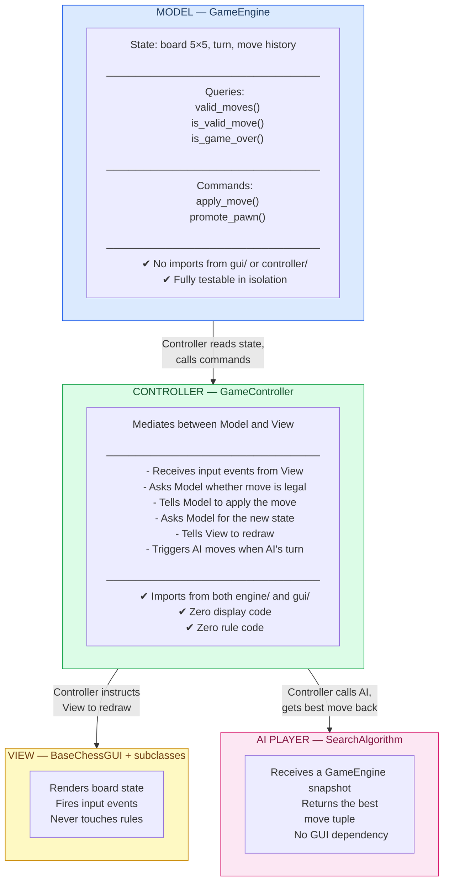
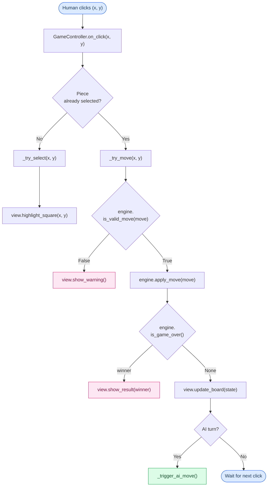

# Mini Chess — Software Architecture

## Table of Contents

1. [Overview](#1-overview)
2. [Pattern: Model-View-Controller (MVC)](#2-pattern-model-view-controller-mvc)
3. [Layer Breakdown](#3-layer-breakdown)
   - [Model — GameEngine](#31-model--gameengine)
   - [View — BaseChessGUI & subclasses](#32-view--basechessgui--subclasses)
   - [Controller — GameController](#33-controller--gamecontroller)
4. [Data Flow](#4-data-flow)
5. [Project Structure](#5-project-structure)
6. [Class Responsibilities at a Glance](#6-class-responsibilities-at-a-glance)
7. [Dependency Rules](#7-dependency-rules)
8. [Adding a New Game Mode](#8-adding-a-new-game-mode)
9. [Testing Strategy](#9-testing-strategy)
10. [Glossary](#10-glossary)

---

## 1. Overview

Mini Chess is a 5×5 chess variant. The codebase follows the
**Model-View-Controller (MVC)** pattern to ensure a clean separation between:

- **what the game knows** (state, rules)
- **what the player sees** (GUI widgets)
- **what coordinates the two** (input handling, turn flow)

This separation means game logic can be tested without a display, the GUI can
be swapped or extended without touching rules, and AI players plug in at the
Controller level without any GUI dependency.

---

## 2. Pattern: Model-View-Controller (MVC)



**One-sentence rule for each layer:**

| Layer      | One-sentence rule                                                             |
| ---------- | ----------------------------------------------------------------------------- |
| Model      | "I know everything about the game; I know nothing about screens."             |
| View       | "I draw what I am told; I do not decide what is legal."                       |
| Controller | "I translate clicks into engine calls and engine results into draw calls."    |
| AI         | "I receive a state snapshot and return a move; I know nothing about screens." |

---

## 3. Layer Breakdown

### 3.1 Model — `GameEngine`

**Location:** `src/engine/game_engine.py`

**Owns:**

- The live game state dict (`board`, `turn`, `move_history`)
- All movement rules (delegated to `src/pieces/`)
- Pawn promotion logic
- Win/draw detection

**Public interface:**

```python
class GameEngine:

    # ── Queries (read-only, never mutate state) ──────────────────
    def valid_moves(self) -> list[tuple]:
        """All legal moves for the current side."""

    def is_valid_move(self, move: tuple) -> bool:
        """True if move is in valid_moves()."""

    def is_game_over(self) -> str | None:
        """Winner message, or None if the game continues."""

    # ── Commands (mutate state) ───────────────────────────────────
    def apply_move(self, move: tuple) -> None:
        """Commit a validated move; handles promotion & turn switch."""
```

**Hard rules:**

- `GameEngine` never imports from `gui/` or `controller/`.
- It never calls `tk.*` anything.
- It operates on plain Python data structures only.

---

### 3.2 View — `BaseChessGUI` & subclasses

**Location:** `src/gui/chess_gui.py`

**Owns:**

- All Tkinter widget creation and layout
- Board rendering (`create_board`, `update_board`)
- End-of-game locking (`disable_buttons`)
- Firing input events upward to the Controller

**Does NOT own:**

- Move validation
- State mutation
- Win/loss detection
- AI logic

**Subclass hook:**

`BaseChessGUI` uses the **Template Method** pattern. Subclasses implement one
hook that controls whether buttons fire a click command:

```python
def _make_button_command(self, i: int, j: int) -> callable | None:
    raise NotImplementedError
```

**Subclasses:**

| Class               | Mode           | Button command                      |
| ------------------- | -------------- | ----------------------------------- |
| `PlayerVsPlayerGui` | Human vs Human | `lambda: controller.on_click(i, j)` |
| `PlayerVsAi`        | Human vs AI    | `lambda: controller.on_click(i, j)` |
| `AiVsAi`            | AI vs AI       | `None` — AI drives the loop         |

**Hard rules:**

- Views never access `GC.state["board"]` directly.
- All state they display is passed in by the Controller via `update_board(state, message)`.
- Views never import from `engine/` or `SearchAlgorithm/`.

---

### 3.3 Controller — `GameController`

**Location:** `src/controller/game_controller.py`

**Owns:**

- The single source of truth: a `GameEngine` instance
- Selection state (`selected_piece`)
- Turn-flow orchestration (human turn → AI turn → human turn …)
- Error messaging (`messagebox` calls move here from the View)

**Public interface:**

```python
class GameController:

    def __init__(self, engine: GameEngine, view: BaseChessGUI):
        ...

    def on_click(self, x: int, y: int) -> None:
        """Entry point for all human input events."""

    def _try_select(self, x: int, y: int) -> None:
        """Select a piece if it belongs to the current player."""

    def _try_move(self, x: int, y: int) -> None:
        """Validate and apply a move, then refresh the view."""

    def _apply_and_refresh(self, move: tuple) -> None:
        """Tell engine to apply move; ask engine for result; tell view to redraw."""

    def _trigger_ai_move(self) -> None:
        """Ask the AI for a move and apply it (used in AI modes)."""
```

**Data flow inside `on_click`:**



**Hard rules:**

- Controller never calls `btn.config(...)` or any other widget method directly.
- All display updates go through a single method: `view.update_board(state, message)`.
- Controller never copies or caches the board array; it always reads from `engine.state`.

---

## 4. Data Flow

### Human move (Player vs Player)

```
1. User clicks a square
2. Tk fires button command → controller.on_click(x, y)
3. Controller asks:  engine.is_valid_move(move)
4. Engine checks piece rules, returns True/False
5. Controller calls:  engine.apply_move(move)
6. Engine mutates board, switches turn
7. Controller calls:  engine.is_game_over()
8. Engine checks for missing kings, returns message or None
9. Controller calls:  view.update_board(engine.state, message)
10. View redraws all buttons from the state dict
```

### AI move (Player vs AI)

```
1. After step 9 above, controller checks: is it the AI's turn?
2. Yes → controller.schedule_ai_move()  (non-blocking, uses root.after())
3. AI search receives engine snapshot → returns best move tuple
4. Controller calls:  engine.apply_move(ai_move)
5. Controller calls:  engine.is_game_over()
6. Controller calls:  view.update_board(engine.state, message)
```

> **Why `root.after()`?**
> Running the AI search synchronously on the main thread freezes the Tk event
> loop. Scheduling it with `root.after(delay_ms, callback)` keeps the UI
> responsive and allows a "thinking…" label to render before the move lands.

---

## 5. Project Structure

```
.
├── main.py                        Entry point — wires Menu → Controller → View
├── src/
│   ├── engine/                    MODEL
│   │   ├── __init__.py
│   │   └── game_engine.py         GameEngine class
│   │
│   ├── controller/                CONTROLLER
│   │   ├── __init__.py
│   │   └── game_controller.py     GameController class
│   │
│   ├── gui/                       VIEW
│   │   ├── __init__.py
│   │   ├── menu_gui.py            Menu (game-mode selection)
│   │   └── chess_gui.py           BaseChessGUI + subclasses
│   │
│   ├── pieces/                    MOVEMENT RULES (used by engine only)
│   │   ├── __init__.py
│   │   ├── king.py
│   │   ├── queen.py
│   │   ├── bishop.py
│   │   ├── knight.py
│   │   └── pawn.py
│   │
│   ├── SearchAlgorithm/           AI (used by controller only)
│   │   └── search.py              minimax / alpha-beta
│   │
│   ├── heuristics/                EVALUATION FUNCTIONS (used by AI only)
│   │   ├── __init__.py
│   │   └── heuristics.py          e0, e1, e2
│   │
│   ├── constants/                 SHARED CONSTANTS (no logic)
│   │   ├── game.py                GameConstants  (initial board, piece symbols)
│   │   ├── gui.py                 GUIConstants   (fonts, colours, board size)
│   │   └── menu.py                MenuConstants  (mode names, heuristic names)
│   │
│   ├── Logger/
│   │   └── mini_chess_logger.py
│   └── logs/
│       └── miniChess.log
└── tests/
    ├── test_engine.py             Unit tests — no Tk needed
    ├── test_controller.py         Integration tests with a mock view
    └── test_pieces.py             Move-generation tests
```

---

## 6. Class Responsibilities at a Glance

| Class               | Package            | Creates widgets? | Touches board array? | Knows rules? |
| ------------------- | ------------------ | ---------------- | -------------------- | ------------ |
| `GameEngine`        | `engine/`          | ✗                | ✔ (owns it)          | ✔            |
| `GameController`    | `controller/`      | ✗                | ✗ (reads via engine) | ✗            |
| `BaseChessGUI`      | `gui/`             | ✔                | ✗                    | ✗            |
| `PlayerVsPlayerGui` | `gui/`             | ✔                | ✗                    | ✗            |
| `PlayerVsAi`        | `gui/`             | ✔                | ✗                    | ✗            |
| `Menu`              | `gui/`             | ✔                | ✗                    | ✗            |
| `SearchAlgorithm`   | `SearchAlgorithm/` | ✗                | ✗ (reads via engine) | ✗            |

---

## 7. Dependency Rules

Dependencies only flow **downward** and **never sideways**:

```
main.py
  └── gui/menu_gui.py
        └── controller/game_controller.py
              ├── engine/game_engine.py
              │     └── pieces/
              ├── gui/chess_gui.py
              └── SearchAlgorithm/search.py
                    └── heuristics/heuristics.py
```

**Forbidden imports (will break the architecture):**

| File                        | Must NEVER import                            |
| --------------------------- | -------------------------------------------- |
| `engine/game_engine.py`     | `gui/`, `controller/`, `tkinter`             |
| `gui/chess_gui.py`          | `engine/`, `controller/`, `SearchAlgorithm/` |
| `SearchAlgorithm/search.py` | `gui/`, `tkinter`                            |
| `pieces/*.py`               | anything outside `pieces/` and `constants/`  |

---

## 8. Adding a New Game Mode

Example: adding **AI vs AI**.

1. **View** — add `AiVsAiGui(BaseChessGUI)` in `chess_gui.py`:

   ```python
   class AiVsAiGui(BaseChessGUI):
       def _make_button_command(self, i, j):
           return None  # no human clicks; AI drives the loop
   ```

2. **Controller** — add `AiVsAiController(GameController)` in `game_controller.py`:

   ```python
   class AiVsAiController(GameController):
       def start(self):
           self._trigger_ai_move()  # starts the automated loop
   ```

3. **Menu** — `_launch_ai_mode` in `menu_gui.py` detects `"AI vs AI"` and
   instantiates `AiVsAiGui` + `AiVsAiController`.

The `GameEngine` and `SearchAlgorithm` need **zero changes**.

---

## 9. Testing Strategy

Because the Model has no GUI dependency, every rule can be tested with plain
`pytest` — no display, no mocking of Tk.

```python
# tests/test_engine.py

from src.engine.game_engine import GameEngine

def test_fresh_state_white_moves_first():
    engine = GameEngine()
    assert engine.state["turn"] == "white"

def test_illegal_move_rejected():
    engine = GameEngine()
    # white pawn at (3,0) cannot jump to (1,0) in one move
    assert engine.is_valid_move(((3, 0), (1, 0))) is False

def test_apply_move_switches_turn():
    engine = GameEngine()
    move = engine.valid_moves()[0]
    engine.apply_move(move)
    assert engine.state["turn"] == "black"

def test_game_over_detects_captured_king():
    engine = GameEngine()
    engine.state["board"][0][0] = "."  # remove black king
    assert engine.is_game_over() is not None
```

For Controller tests, inject a **mock view** so tests never open a window:

```python
# tests/test_controller.py

class MockView:
    def update_board(self, state, message): self.last_message = message
    def disable_buttons(self): self.disabled = True
    def highlight_selected(self, x, y): pass

def test_illegal_move_does_not_change_state():
    engine = GameEngine()
    view   = MockView()
    ctrl   = GameController(engine, view)
    original_board = [row[:] for row in engine.state["board"]]
    ctrl.on_click(0, 0)            # select a black piece on white's turn
    assert engine.state["board"] == original_board
```

---

## 10. Glossary

| Term                | Definition                                                                                                                                                       |
| ------------------- | ---------------------------------------------------------------------------------------------------------------------------------------------------------------- |
| **Model**           | The `GameEngine`. Owns state and rules. No display code.                                                                                                         |
| **View**            | Any `BaseChessGUI` subclass. Renders state, fires events. No rule code.                                                                                          |
| **Controller**      | `GameController`. Translates events into engine calls and view updates.                                                                                          |
| **State**           | The dict `{ "board": [[...]], "turn": "white"/"black", ... }` owned by the engine.                                                                               |
| **Move**            | A tuple `((start_row, start_col), (end_row, end_col))`.                                                                                                          |
| **Template Method** | Design pattern used in `BaseChessGUI`: the base class defines the algorithm (`create_board`) and calls a hook (`_make_button_command`) that subclasses override. |
| **DXA**             | Unit used in .docx files. Not relevant here — see docx skill.                                                                                                    |
| **Alpha-Beta**      | Pruning optimisation for minimax search; toggled in the Menu and passed to `SearchAlgorithm`.                                                                    |
| **Heuristic**       | Evaluation function (`e0`, `e1`, `e2`) used by the AI to score non-terminal board states. Lives in `src/heuristics/`.                                            |
