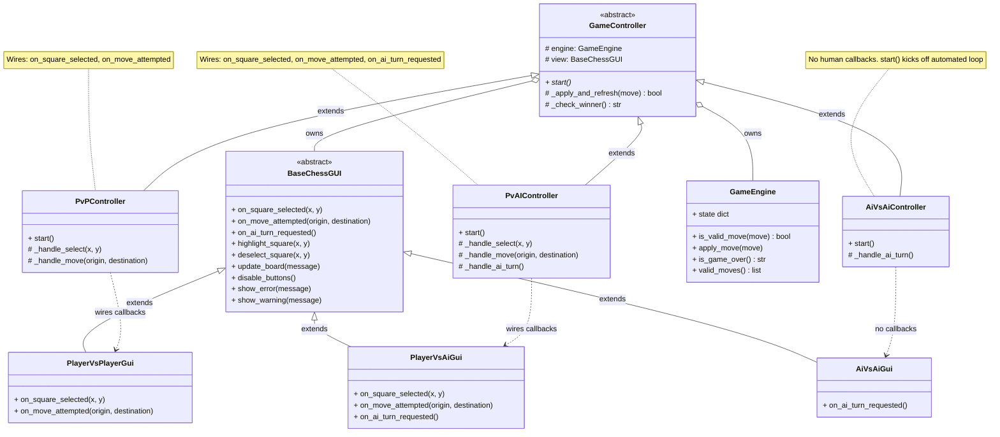

# Game controller — architecture

## Overview

The diagram represents a controller hierarchy for a game system that supports multiple play modes:

- Player vs Player (PvP)
- Player vs AI (PvAI)
- AI vs AI

At the core is a shared base class, **`GameController`**, which provides common functionality, while specialized controllers extend it to implement specific behaviors.

---

### Base Class: GameController

`GameController` is the abstract foundation for all game modes.

**Responsibilities**

- Holds references to:
  - the game engine (game state & rules)
  - the view (UI layer)

- Implements shared logic:
  - \_apply_and_refresh() → applies a move and updates the UI
  - \_check_winner() → determines if the game is over

- Declares an abstract method:
  - start() → defines how each game mode begins

This design centralizes all common game logic, avoiding duplication across modes.

---

### PvPController (Player vs Player)

This controller handles human vs human interaction.

**Adds:**

- \_handle_select() → processes selecting a piece/square
- \_handle_move() → processes a move attempt

**Behavior:**

- Connects to user interactions from the view:
  - on_square_selected
  - on_move_attempted

Both players are humans, so all actions come from UI events.

---

### PvAIController (Player vs AI)

This controller manages a hybrid interaction between a human and an AI.

**Adds:**

- \_handle_select() → human selects a piece
- \_handle_move() → human makes a move
- \_handle_ai_turn() → AI computes and plays its move

**Behavior:**

- Wires the same human events as PvP:
  - on_square_selected
  - on_move_attempted

- Additionally listens for:
  - on_ai_turn_requested

After a human move, the AI takes over automatically when triggered.

---

### AiVsAiController (AI vs AI)

This controller handles a fully automated game.

**Adds:**

- \_handle_ai_turn() → executes moves for both sides

**Overrides:**

- start() → immediately begins an automated loop

**Behavior:**

- No interaction with the view
- No user input
- Runs a continuous loop where both players are AI

This mode is useful for simulations, testing, or demonstrations.

---

### UML diagram:

