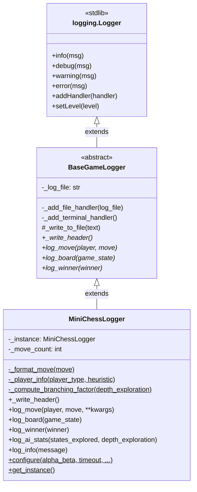

# Logging Architecture

## Overview

The logging system is built as a three-layer hierarchy. Each layer adds responsibility without changing what the class fundamentally _is_ — a logger.

```
logging.Logger          (Python stdlib)
    └── BaseGameLogger  (abstract — adds handlers + trace file channel)
            └── MiniChessLogger  (concrete — chess-specific formatting + singleton)
```

---

## Layer 1 — `logging.Logger` (Python stdlib)

The root of the hierarchy. Provides the core logging primitives inherited by every class above it:

- `self.info(msg)`
- `self.debug(msg)`
- `self.warning(msg)`
- `self.error(msg)`
- Handler registration via `self.addHandler()`
- Log level filtering via `self.setLevel()`
  No modifications are made at this level — it is consumed as-is.

## Layer 2 — `BaseGameLogger(logging.Logger, ABC)`

**File:** `src/logging/base_game_logger.py`

Extends both `logging.Logger` and Python's `ABC` (Abstract Base Class). This means:

- It **is** a fully functional stdlib logger (inherits all log methods)
- It **cannot be instantiated directly** — subclasses must implement the abstract interface
- It owns both output channels: terminal (via logging handlers) and trace file (via `_write_to_file`)

### Why extend both `logging.Logger` and `ABC`?

Extending `logging.Logger` gives the "is-a logger" semantics — any code that accepts a `logging.Logger` will accept a `MiniChessLogger` transparently. Extending `ABC` enforces the contract that all game loggers must implement the same interface regardless of the game type.

### Constructor

```python
def __init__(self, logger_name: str, log_file: str)
```

Calls `super().__init__(logger_name, logging.DEBUG)` to initialize the stdlib logger, then sets up both handlers. A duplicate handler guard (`if not self.handlers`) prevents double-logging if the same logger name is reused.

### Handler Setup (private)

| Method                        | Purpose                                                    |
| ----------------------------- | ---------------------------------------------------------- |
| `_add_file_handler(log_file)` | Attaches a `FileHandler` with timestamp + level formatting |
| `_add_terminal_handler()`     | Attaches a colorized `StreamHandler` via `colorlog`        |

Both handlers read date format and color config from `SetupConstants`.

### Raw Trace Channel (protected)

```python
def _write_to_file(self, text: str) -> None
```

Writes unformatted text directly to the trace file, bypassing the logging formatter entirely. This is necessary for structured sections — board grids, stat tables, headers — where timestamps and level tags would pollute the output.

### Abstract Interface

Every subclass **must** implement these four methods:

| Method                             | Responsibility                                                   |
| ---------------------------------- | ---------------------------------------------------------------- |
| `_write_header()`                  | Write the trace file header — called automatically on `__init__` |
| `log_move(player, move, **kwargs)` | Record a single move to both output channels                     |
| `log_board(game_state)`            | Record the board state to the trace file                         |
| `log_winner(winner)`               | Record the game result to both output channels                   |

---

## Layer 3 — `MiniChessLogger(BaseGameLogger)`

**File:** `src/logging/mini_chess_logger.py`

The concrete implementation for Mini Chess. Adds chess-specific formatting, AI statistics logging, and a **singleton interface** to ensure only one game trace exists per session.

### Constructor — Attribute Order Matters

```python
def __init__(self, config: GameConfig):
    self.config = config
    self._move_count = 0
    # super().__init__ MUST come last
    # — it calls _write_header() which reads self.config
    super().__init__(logger_name="MiniChessLogger", log_file=...)
```

All instance attributes must be assigned before `super().__init__()` is called because the parent immediately invokes `_write_header()`. Reversing this order causes an `AttributeError`.

### Private Helpers (static)

| Method                                         | Purpose                                                         |
| ---------------------------------------------- | --------------------------------------------------------------- |
| `_format_move(move)`                           | Converts `(row, col)` tuples → chess notation e.g. `"B2 to B3"` |
| `_player_info(player_type, heuristic)`         | Formats player descriptor for the trace header                  |
| `_compute_branching_factor(depth_exploration)` | Calculates average branching factor from depth stats            |

These are `@staticmethod` because they operate purely on their arguments — no instance state needed.

### Implemented Methods

#### `_write_header()`

Called once automatically on construction. Writes a single `self.info()` line to the terminal and the full game config block to the trace file.

#### `log_board(game_state)`

Writes the board grid to the trace file only — raw rows, no logging formatter.

#### `log_move(player, move, *, ai_time, heuristic_score, alpha_beta_score, mini_max_score, valid)`

Dual output:

- **Terminal** → concise single line via `self.info()` (or `self.warning()` for invalid moves)
- **Trace file** → full structured entry with optional AI stats
  Increments `_move_count` only on valid moves.

#### `log_ai_stats(states_explored, depth_exploration)`

Dual output:

- **Terminal** → summary line (total states + branching factor)
- **Trace file** → full depth breakdown with per-depth counts and percentages

#### `log_winner(winner)`

Dual output:

- **Terminal** → `self.info()` with the result
- **Trace file** → result wrapped in separator lines

#### `log_info(message)`

Convenience passthrough — writes the same message to both channels.

---

## Singleton Interface

`MiniChessLogger` enforces a singleton pattern to guarantee only one game trace file is active per session.

### Class variable

```python
_instance: MiniChessLogger | None = None
```

Holds the single instance. `None` until `configure()` is called.

### `configure(...)` — call once from the game menu

```python
@classmethod
def configure(cls, alpha_beta, timeout, ...) -> MiniChessLogger
```

Creates and stores the singleton instance. Should be called once at game startup, before any other component calls `get_instance()`.

### `get_instance()` — call anywhere in the app

```python
@classmethod
def get_instance(cls) -> MiniChessLogger
```

Returns the existing instance. Raises a `RuntimeError` with a clear message if `configure()` was not called first — failing loudly rather than silently returning `None`.

### Usage pattern

```python
# main.py / game menu — once at startup
import logging
logging.setLoggerClass(MiniChessLogger)

MiniChessLogger.configure(
    alpha_beta=True,
    timeout=5,
    max_turns=100,
    player1_type="AI",
    player2_type="Human",
    heuristic1="e1",
)

# Anywhere else in the codebase
logger = MiniChessLogger.get_instance()
logger.info("Native stdlib call — colorized terminal output")
logger.log_move("White", move, ai_time=0.42)
logger.log_ai_stats(states_explored=1024, depth_exploration={1: 10, 2: 80, 3: 934})
logger.log_winner("White")
```

### Why `setLoggerClass` must come first

Python's `logging` module caches logger instances by name. If anything calls `logging.getLogger("MiniChessLogger")` before `setLoggerClass` is set, it caches a plain `logging.Logger` and the subclass never takes effect. Setting it as the very first line of `main.py` prevents this.

---

## Output Channels at a Glance

| Event        | Terminal                          | Trace File               |
| ------------ | --------------------------------- | ------------------------ |
| Startup      | `info` — "game trace initialized" | Full config header       |
| Board state  | —                                 | Raw grid rows            |
| Valid move   | `info` — concise one-liner        | Full entry with AI stats |
| Invalid move | `warning`                         | One-line note            |
| AI stats     | `info` — summary                  | Full depth breakdown     |
| Game over    | `info` — result                   | Result with separators   |
| `log_info()` | `info`                            | Raw line                 |

---

## Adding a New Game Logger

To add a logger for a different game (e.g. `CheckersLogger`), extend `BaseGameLogger` and implement the four abstract methods:

```python
class CheckersLogger(BaseGameLogger):

    def __init__(self, config: CheckersConfig):
        self.config = config
        self._move_count = 0
        super().__init__(logger_name="CheckersLogger", log_file="checkers_trace.txt")

    def _write_header(self) -> None: ...
    def log_move(self, player, move, **kwargs) -> None: ...
    def log_board(self, game_state) -> None: ...
    def log_winner(self, winner) -> None: ...
```

All handler setup, the duplicate handler guard, and the `_write_to_file` channel are inherited for free.

## UML Diagram


